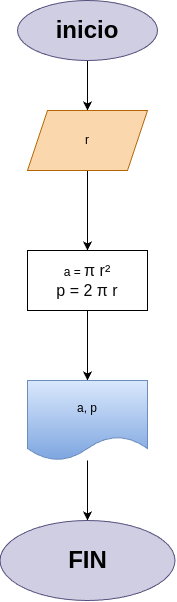

# Programa #1: Área perímetro círculo
programa en Python para calcular el área y perímetro de un círculo, dado el valor de su radio

## Análisis

### Variables de entrada
 - $r$: Radio del círculo

### Procesamiento

 - $a$: Área del cículo

 - $p$: Perímetro del círculo

 - $a = π * r²$

 - $p = 2π * r$

## Diseño

## Construcción
 - código implementado en el archivo "area perimetro circulo.py"